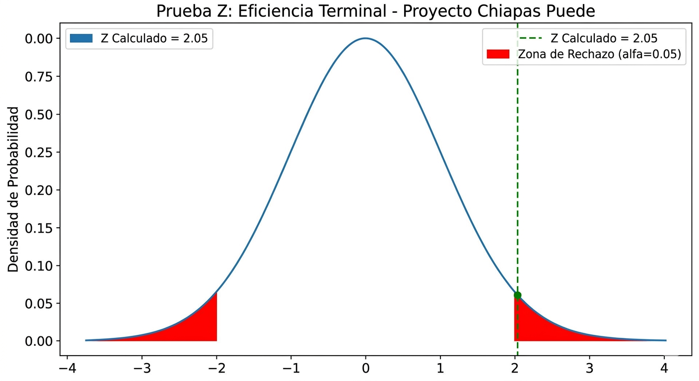

# 📊 Evaluación de Impacto: Proyecto "Chiapas Puede"

**Ubicación:** Micro-región Tuxtla Gutiérrez Oriente  
**Modalidad:** Células de Alfabetización (Desescolarizada / Domiciliaria / Modelo Matías de Córdova)

Este repositorio contiene la base de datos, los scripts de análisis y la validación estadística que sustentan la investigación: **"Desescolarizar para alfabetizar"**. El objetivo es demostrar mediante rigor científico cómo la atención domiciliaria rompe las barreras de acceso a la educación para adultos.

---

## 1. 📈 Datos de la Muestra y Eficiencia Terminal

Se midió la eficiencia terminal de la Célula de Alfabetización, contrastando los resultados frente a la media histórica de los modelos tradicionales.

| Métrica | Datos | Porcentaje |
| :--- | :---: | :---: |
| **Población Total (N)** | 19 educandos | 100% |
| **Total de Egresados** | 13 educandos | **68.4%** |

### Desglose por Género
*Nota: La metodología desescolarizada permite que las responsabilidades de cuidado no se conviertan en una barrera de género.*

| Género | Inscritos | Aprobados | Tasa de Éxito |
| :--- | :---: | :---: | :---: |
| **Mujeres** | 11 | 7 | **63.6%** |
| **Hombres** | 8 | 6 | **75.0%** |

---

## 2. 🧮 Prueba de Significancia Estadística (Prueba Z)

Para demostrar que el **68.4%** de retención es un resultado estadísticamente superior al modelo estándar, se aplicó una **Prueba Z para una proporción poblacional**.

**Variables del Modelo:**
* `n` (Muestra) = 19
* `x` (Éxitos) = 13
* `p` (Proporción obtenida) = 0.684
* `P_0` (Media histórica) = 0.45 (45%)
* `α` (Nivel de significancia) = 0.05 (Confianza del 95%)

**Resultado Z:** `2.0508`

> **Conclusión:** Dado que **Z (2.05) > 1.96** y el valor $p < 0.05$, se confirma que la mejora en la retención no es producto del azar, sino de la efectividad del modelo de intervención domiciliaria.

### Visualización del Resultado (Campana de Gauss)

La siguiente gráfica muestra la distribución normal estándar. El éxito del proyecto "Chiapas Puede" (Z=2.05, marcado en verde) cae claramente dentro de la zona de rechazo de la hipótesis nula (Z > 1.96, área roja), lo que valida estadísticamente la superioridad del modelo domiciliario desescolarizado.

---

## 🛠️ Herramientas y Metodología
* **Python 3.x:** Script de cálculo para la Prueba Z (ubicado en `/analisis`).
* **Dataset:** Registro anónimo de seguimiento (ubicado en `/datos`).
* **Instrumentos:** Guías de observación etnográfica y diarios de campo.

## ✒️ Cómo citar este repositorio
Ibáñez Nangüelú, C. R. (2026). *alfabetizacion-chiapas-puede* [Análisis estadístico]. GitHub. https://github.com/cribnez/alfabetizacion-chiapas-puede
